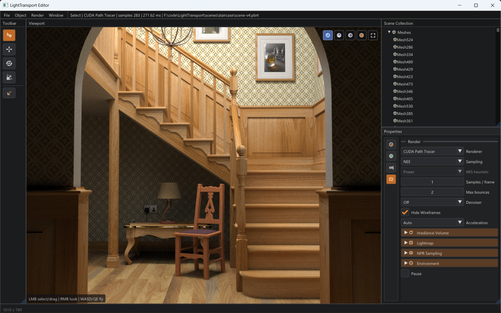

# LightTransport



LightTransport is an experimental light transport renderer playground for prototyping path tracing, material/import pipelines, real-time editor preview, precomputed GI, and denoising reconstruction. The current codebase is a research and engineering iteration environment rather than a stable SDK.

## Current Capabilities

- **CPU path tracer**: BVH acceleration, triangle mesh, analytic sphere, mesh light, environment light, MIS.
- **Optional CUDA path tracer**: shares the same Scene/RenderSettings, supports GPU BVH traversal and triangle light lists.
- **ImGui + DirectX 11 editor**: Blender-style layout with Scene Collection, Properties, viewport selection, gizmo, and Solid/Wireframe/Material Preview/Rendered modes.
- **GPU picking and selection outline**: object-id picking shared across Rendered/Solid/Wireframe modes, with an orange outline overlay on the selected object.
- **Materials and import**: Lambertian, Principled, Mirror, Dielectric, Conductor, supporting `.lt`, glTF/GLB, PBRT, FBX/PyScene, and other import paths.
- **Textures and environment**: basic PPM/HDR support; PNG/JPEG via WIC on Windows; HDR/EXR with fallback paths.
- **NPR experiments**: Color Map, X-Toon, Cross Hatching, primarily via CPU fallback.
- **Precomputed GI**: Irradiance Volume and Lightmap, with caching, editor background baking, and CPU/CUDA queries.
- **SVGF real-time denoising**: CPU/CUDA implementations, supporting rasterized G-buffer, debug view, StablePostAA/TAA.
- **CUDA wavefront experiments**: queue-based path tracing, internal BVH8/CWBVH traversal layouts, and ReSTIR DI/GI/PT prototypes.
- **Image output**: CLI writes `.ppm` or `.png` based on file extension; the editor can save the current rendered framebuffer as a PNG screenshot.

## Building

We recommend using a separate build directory for each CMake generator. Do not switch a directory already configured for Visual Studio directly to Ninja; if you need to switch, create a new directory or delete the old one.

Visual Studio 2022:

```powershell
cmake -S . -B build -G "Visual Studio 17 2022" -A x64 -DLT_ENABLE_CUDA=ON
cmake --build build --config Release
```

Ninja:

```powershell
cmake -S . -B build-ninja -G Ninja -DCMAKE_BUILD_TYPE=Release -DLT_ENABLE_CUDA=ON
cmake --build build-ninja
```

Without CUDA:

```powershell
cmake -S . -B build-ninja -G Ninja -DCMAKE_BUILD_TYPE=Release -DLT_ENABLE_CUDA=OFF
cmake --build build-ninja
```

Delete the old build directory before switching generators:

```powershell
Remove-Item -Recurse -Force build
```

## Command-Line Rendering

Basic format:

```text
lt_render [scene_path] [output_path] [options...]
```

Examples:

```powershell
.\build\Release\lt_render.exe scenes\cornell.lt out.png --cuda
.\build\Release\lt_render.exe scenes\cornell.lt out.ppm --cpu --size 512 512 --frames 16
.\build\Release\lt_render.exe path\to\model.glb model.png --cpu
.\build\Release\lt_render.exe https://example.com/model.glb remote.png --cpu
.\build\Release\lt_render.exe scenes\cornell.lt mis.png --cuda --mis --mis-heuristic balance
.\build\Release\lt_render.exe scenes\cornell.lt wavefront.png --cuda --cuda-wavefront --spp 1
.\build\Release\lt_render.exe scenes\cornell.lt megakernel.png --cuda --cuda-megakernel --spp 1
```

SVGF:

```powershell
.\build\Release\lt_render.exe scenes\cornell.lt svgf.png --cuda --denoiser svgf --aa stable --spp 1 --frames 16
.\build\Release\lt_render.exe scenes\cornell.lt svgf_taa.png --cuda --denoiser svgf --aa taa --spp 1 --frames 16
```

Irradiance Volume / Lightmap:

```powershell
.\build\Release\lt_render.exe scenes\cornell.lt ivol.png --cpu --irradiance-volume --ivol-force-bake
.\build\Release\lt_render.exe scenes\cornell.lt lightmap.png --cpu --lightmap --lightmap-force-bake
```

NPR:

```powershell
.\build\Release\lt_render.exe scenes\cornell.lt xtoon.png --cpu --style x-toon --xtoon-mode highlight --style-samples 16 --style-depth 1
.\build\Release\lt_render.exe scenes\cornell.lt mixed.png --cpu --material-style blue x-toon --material-style white color-map --style-range 0 1
.\build\Release\lt_render.exe scenes\toon_material_test.lt hatch.png --cpu --material-style white cross-hatching --style-samples 64 --style-depth 1 --hatch-sets 3 --hatch-spacing 0.08 --hatch-width 0.012 --hatch-passthrough --hatch-shadow-only
```

For Ninja builds, executables are under `build-ninja`:

```powershell
.\build-ninja\lt_render.exe scenes\cornell.lt out.png --cuda
```

## Editor

Launch:

```powershell
.\build\Release\lt_editor.exe scenes\cornell.lt
```

Common controls:

- `W/A/S/D/Q/E`: move the camera when viewport is focused or hovered.
- Hold right mouse button and drag: look around.
- Left-click in Select mode: select an object in the viewport.
- Move mode: drag to translate the selected object.
- Rotate mode: drag to rotate the selected mesh.
- Scale mode: drag to scale the selected mesh.
- `Ctrl+R`: reset sample accumulation.
- `Space`: pause/resume preview accumulation.
- `Ctrl+S`: save the current `.lt` scene.
- `Ctrl+Shift+S`: Save As.
- `Shift+A`: add a mesh.
- `Ctrl+D`: duplicate the selected object.
- `Delete`: delete the selected object.
- `Esc`: exit.

Menus and panels:

- `File > Save Render Screenshot...`: save the current rendered framebuffer as a PNG, excluding ImGui overlays.
- The viewport top-right corner switches between Rendered, Material Preview, Solid, Wireframe, and fullscreen modes.
- Properties > Render controls backend, samples, bounce depth, MIS, SVGF, Irradiance Volume, Lightmap, HDRI, etc.
- Properties > Material controls material, texture, and NPR parameters.

The editor layout is inspired by Blender: top menu bar, left toolbar, central viewport, right Scene Collection panel, bottom-right Properties panel, and a bottom status bar.

## Scenes and Assets

The native `.lt` format is plain text, supporting comments and declarations for camera, texture, environment, material, NPR, sphere, mesh, light, and more. Example outline:

```text
camera px py pz  tx ty tz  fov_degrees
texture name  path.ppm
environment r g b  strength  [environment_texture_name]
material name  r g b  brdf  roughness metallic  [albedo_texture_name]
npr material_name  color_map value_min value_max
light mesh_name  color_r color_g color_b  intensity
sphere name material_name  cx cy cz  radius
mesh name material_name  tx ty tz  rx ry rz  sx sy sz  vertex_count triangle_count
vx vy vz
...
i0 i1 i2
...
```

Import paths include:

- `.lt`
- `.glb` / `.gltf`
- `.pbrt`
- `.fbx`
- `.pyscene`

glTF import supports static triangle meshes, node transforms, vertex normals, UVs, base color textures, and metallic/roughness parameters. Animation, skinning, morph targets, and saving back to glTF are not yet implemented.

## Developer Documentation

Detailed developer documentation is available at [doc/README.md](doc/README.md). Start there to dive into topics such as:

- [Irradiance Volume](doc/10-irradiance-volume.md)
- [Lightmap](doc/11-lightmap.md)
- [Viewport View](doc/12-viewport-view.md)
- [SVGF](doc/13-svgf.md)
- [CWBVH](doc/13.5-cwbvh.md)
- [Wavefront Path Tracing Optimization](doc/14-wavefront-path-tracing-optimization.md)
- [ReSTIR DI](doc/15-wavefront-restir-di.md)
- [ReSTIR GI](doc/16-wavefront-restir-gi.md)
- [ReSTIR PT](doc/17-wavefront-restir-pt.md)

Each topic covers the theory and formulas, data structures, CPU/CUDA/D3D11 implementation paths, editor entry points, and dirty/cache/history rules with verification methods.

## Output and Screenshots

`lt_render` selects a writer based on the output file extension:

- `.ppm`: ASCII P3, suitable for simple regression checks.
- `.png`: 8-bit RGBA PNG from `Framebuffer::rgba`, already clamped with gamma 2.2 applied.

The editor's current screenshot function saves the rendered framebuffer only, without viewport UI, selection outlines, or ImGui controls. Capturing the full viewport UI requires future support for D3D11 backbuffer or viewport render target readback.
