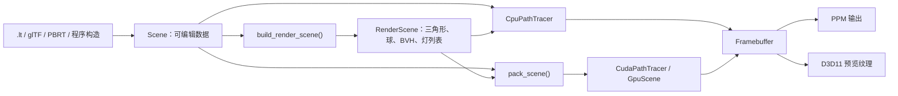

# 项目架构

## 构建目标

根目录 [`CMakeLists.txt`](../CMakeLists.txt) 定义三个主要目标：

| 目标 | 类型 | 作用 |
| --- | --- | --- |
| `lt_core` | 静态/默认库目标 | 场景、材质、纹理、导入器、CPU 路径追踪和可选 CUDA 后端 |
| `lt_render` | 控制台程序 | 加载场景、渲染若干累积帧、写出 PPM |
| `lt_editor` | Windows GUI 程序 | ImGui + DirectX 11 编辑器和交互预览 |

主要 CMake 选项：

- `LT_ENABLE_CUDA`：尝试启用 CUDA；找不到编译器时仍会构建 CPU 版本。
- `LT_BUILD_EDITOR`：是否构建编辑器。
- `LT_FETCH_IMGUI`：是否通过 `FetchContent` 获取 Dear ImGui。

`lt_core` 的公开 include 目录是 `include/`。外部 CMake 目标链接 `lt_core` 后即可包含 `lt/scene.h`、`lt/renderer.h` 等头文件。

## 分层

项目刻意分成两类场景数据：

- `Scene` 是可编辑、可导入、可保存的数据模型，保留对象名、材质对象、局部顶点和变换。
- `RenderScene` 是 CPU 求交使用的派生数据，顶点已经变换到世界空间，并包含 BLAS/TLAS、扁平 BVH 和三角形灯索引。

不要直接长期保存由 `build_render_scene()` 返回的数据并假定它会自动跟随 `Scene` 更新。几何变化后必须重建。

## 目录职责

### `include/lt`

公开 API：

- `math.h`：向量、射线、随机数、颜色编码。
- `texture.h`：纹理数据、采样和文件加载。
- `material.h`：材质基类、BRDF 派生类、NPR 配置。
- `scene.h`：可编辑场景、渲染场景、加载保存和基础几何生成。
- `renderer.h`：渲染设置、帧缓冲和渲染器接口。

### `src/scene`

- `scene_geometry.cpp`：基础几何生成、默认场景和材质查找。
- `render_scene.cpp`：把 `Scene` 展开为世界空间图元并构建 BVH。
- `scene_io.cpp`：统一加载入口、原生 `.lt` 读取和保存。
- `scene_internal.h`：只供场景实现使用的辅助函数。

### `src/cpu`

[`path_tracer.cpp`](../src/cpu/path_tracer.cpp) 把多个 `.inl` 文件组合在同一个匿名命名空间中：

- `types.inl`：CPU 命中信息 `Hit`。
- `camera.inl`：主相机射线。
- `intersection.inl`：球、三角形、AABB、BVH/TLAS 求交。
- `shading.inl`：环境、直接光、MIS、BRDF 路径和 NPR。
- `renderer.inl`：多线程逐行渲染、累积和 RGBA 输出。

这些 `.inl` 不是公共头文件；它们是 CPU 后端的内部实现拆分。

### `src/gpu`

- `types.cuh`：扁平 GPU 数据结构。
- `scene_upload.cuh`：CPU 场景打包、纹理对象和显存上传。
- `intersection.cuh`：设备端求交。
- `shading.cuh`：设备端材质和路径追踪。
- `kernel.cuh`：每像素 CUDA kernel。
- `cuda_path_tracer.cu`：资源生命周期、脏数据上传和 kernel 启动。
- `math.cuh`：CUDA 设备端数学辅助。

没有 CUDA 时，[`src/cpu/cuda_stub.cpp`](../src/cpu/cuda_stub.cpp) 提供同一 `CudaPathTracer` API，并回退到 CPU。

### 导入、CLI 和编辑器

- `src/gltf_loader.cpp`：静态 glTF 2.0 导入。
- `src/pbrt/pbrt_loader.cpp`：PBRT 文本、PLY 和部分材质/灯光导入。
- `src/cli/render_options.*`：命令行解析和材质风格覆盖。
- `src/main.cpp`：离线渲染入口。
- `src/editor/editor_state.*`：编辑器全局状态和异步任务数据。
- `src/editor/editor_platform.*`：Win32/D3D11 资源。
- `src/editor_win32.cpp`：编辑器操作、拾取、gizmo、面板和主循环。

## 核心对象的所有权

`Scene` 使用以下所有权方式：

- `materials`：`std::vector<std::shared_ptr<Material>>`
- `textures`：`std::vector<std::shared_ptr<Texture>>`
- 材质中的纹理字段也持有 `shared_ptr<Texture>`
- `meshes` 和 `spheres` 按值存储

复制 `Scene` 时：

- 材质通过虚函数 `clone()` 深拷贝，避免编辑副本时修改原场景材质。
- 纹理指针只复制 `shared_ptr`，多个场景副本共享同一纹理对象。
- Mesh、Sphere、Camera、Environment 按值复制；Environment 的纹理仍共享。

因此新增 `Material` 派生类时，正确实现 `clone()` 是硬性要求。若要编辑纹理像素而不影响另一个 Scene 副本，需要调用方自行复制 `Texture`。

## 帧与缓存

渲染是渐进累积的：

1. `RenderSettings::frame_index` 表示当前累积帧，从 0 开始。
2. 每帧每像素产生 `samples_per_pixel` 个样本。
3. 样本加到 `Framebuffer::accumulation`。
4. 显示颜色除以 `frame_index + 1` 后转为 RGBA8。

调用方改变相机、材质、几何或渲染设置时应：

1. 把 `frame_index` 重置为 0。
2. 清空 `Framebuffer`。
3. 设置对应 `RenderDirty`。
4. 必要时调用渲染器 `reset()` 释放全部缓存。

编辑器的 `reset_accumulation()` 已封装前 3 步。CLI 每次创建新 Framebuffer，并在首帧传 `RenderDirty::All`。

## CPU 与 CUDA 的一致性边界

CPU 使用多态 `Material` API；CUDA 使用 `GpuMaterial` 中的整数模型 ID 和扁平字段。因此每项渲染功能可能有三层：

1. 公共/CPU 数据模型。
2. `pack_scene()` 的 GPU 数据转换。
3. CUDA 设备端实现。

只改第 1 层时，CPU 可能正常而 CUDA 丢字段或表现不同。新增功能前先决定支持矩阵：

| 支持目标 | 最少要改 |
| --- | --- |
| 仅 CPU 实验 | 公共数据 + CPU 实现，并在后端选择处强制 CPU |
| CPU 和 CUDA | 公共数据 + CPU + GPU 类型 + 打包 + CUDA 实现 |
| 可保存和可编辑 | 再加 `.lt` I/O、CLI/编辑器 UI |
| 可从 glTF/PBRT 导入 | 再改相应导入器 |

NPR 是当前“仅 CPU 实验”的例子：`stylized_rendering_enabled()` 为真时，CLI 和编辑器会主动选择 CPU。
