# CUDA Wavefront ReSTIR DI：从论文到实现

本文从直接光积分开始，逐节转述 Bitterli 等人的 ReSTIR DI 论文，并说明 NVIDIA RTXDI 与本项目 CUDA wavefront 实现分别增加了什么。本文不是论文的逐字翻译；公式、算法关系和实验结论按原文重述，工程部分则以当前源码为准。

## 1. 范围与资料

当前实现只替换 CUDA wavefront path tracer 的主表面直接光：

- `cuda_restir_di` 仅在 `NEE` 或 `MIS` 模式生效，默认关闭。
- 第一次非 delta 表面命中使用 ReSTIR DI；次级表面仍走原有 NEE/MIS。
- CPU、CUDA megakernel、`UNI`、lightmap 和 irradiance volume 不受影响。
- 发光三角形、点光、方向光、常量环境和 HDRI 环境统一进入 light sample/reservoir。
- ReSTIR GI/PT 与 DI 是独立估计器；它们可以调用相同的初始光源采样工具，但不共享 DI reservoir。

主要源码：

- `src/gpu/restir_di.cuh`
- `src/gpu/cuda_path_tracer.cu`
- `src/gpu/scene_upload.cuh`
- `src/gpu/types.cuh`
- `include/lt/renderer.h`

参考资料：

- Bitterli et al., *Spatiotemporal Reservoir Resampling for Real-Time Ray Tracing with Dynamic Direct Lighting*, SIGGRAPH 2020。
- NVIDIA RTXDI: [Integration Guide](https://github.com/NVIDIA-RTX/RTXDI/blob/main/Doc/Integration.md) 与 [Noise and Bias](https://github.com/NVIDIA-RTX/RTXDI/blob/main/Doc/NoiseAndBias.md)。

## 2. Section 1：问题是什么

在表面点 $y$、观察方向 $\omega_o$ 上，直接光可以写成光源表面上的积分：

$$
L_d(y,\omega_o)
=
\int_{\mathcal A}
f_r(y,\omega_{xy},\omega_o)
L_e(x,-\omega_{xy})
G(x,y)
V(x,y)
\,\mathrm dA_x .
$$

其中 $G$ 包含两端余弦与距离平方衰减，$V\in\{0,1\}$ 是可见性。把整个被积函数记作 $f(x)$，问题就是估计

$$
I=\int_{\mathcal A}f(x)\,\mathrm dx.
$$

普通实时 NEE 的困难不是“一条 shadow ray 很贵”，而是大量动态光源下很难用一次光源采样找到高贡献样本。ReSTIR 的核心选择是：先用便宜的未遮挡 target 从许多候选中保留一个，再让时间和空间邻居的 reservoir 继续参加竞争，最后只对少数被选中的样本追踪可见性。

这不是降噪器。它改变的是抽样分布，并输出一个仍需跨帧/跨样本累积的随机估计量。论文中的展示通常还配合时间累积和 denoising，因此不能把展示图的平滑程度直接当作单帧 reservoir 的预期结果。

## 3. Section 2：IS、MIS、RIS 与 WRS

### 3.1 Section 2.1：重要性采样

若 $x_i\sim p(x)$，普通重要性采样为

$$
\widehat I_{\mathrm{IS}}
=
\frac{1}{N}\sum_{i=1}^{N}\frac{f(x_i)}{p(x_i)}.
$$

方差取决于 $p$ 与 $|f|$ 的匹配程度。直接光里，理想 PDF 同时依赖材质、几何、辐射和遮挡，通常无法廉价构造。

多个 proposal 可用 MIS 合并：

$$
\widehat I_{\mathrm{MIS}}
=
\sum_s\frac{1}{N_s}
\sum_{i=1}^{N_s}
m_s(x_{s,i})\frac{f(x_{s,i})}{p_s(x_{s,i})},
\qquad
\sum_s m_s(x)=1.
$$

### 3.2 Section 2.1：RIS

RIS 不要求直接从理想分布采样。先从 source PDF $p(x)$ 生成 $M$ 个候选，再用可计算但无需归一化的 target $\widehat p(x)$ 重采样：

$$
w_i=\frac{\widehat p(x_i)}{p(x_i)},
\qquad
P(z=i\mid x_{1:M})=\frac{w_i}{\sum_{j=1}^{M}w_j}.
$$

令最终样本 $y=x_z$，RIS 估计量为

$$
\widehat I_{\mathrm{RIS}}
=
\frac{f(y)}{\widehat p(y)}
\frac{1}{M}\sum_{j=1}^{M}w_j.
$$

重要区别是：$\widehat p$ 只负责“更愿意选择谁”，真正的颜色仍来自 $f(y)$。因此 target 可以用标量亮度，而最终贡献保留 RGB；target 也可以暂时忽略可见性，但最后必须把可见性乘回 $f$。

### 3.3 Section 2.2：加权 reservoir sampling

Weighted Reservoir Sampling 让 RIS 可以流式处理。reservoir 保存：

- 选中样本 $y$；
- 累计权重 $w_{\mathrm{sum}}$；
- 已处理候选数 $M$；
- 选中样本 target $\widehat p(y)$；
- finalize 后的贡献权重 $W$。

新候选 $(x_i,w_i)$ 到达时：

$$
w_{\mathrm{sum}}\leftarrow w_{\mathrm{sum}}+w_i,
$$

并以概率

$$
P(\text{replace})=\frac{w_i}{w_{\mathrm{sum}}}
$$

替换当前样本。处理完后：

$$
W=\frac{w_{\mathrm{sum}}}{M\widehat p(y)},
\qquad
\widehat I=f(y)W.
$$

reservoir 不是“缓存一盏灯的颜色”。$W$、$M$ 和 selected target 共同描述一个随机估计器；漏掉 $M$、重复除 proposal PDF、或在 receiver 改变后继续沿用旧 target，都会造成亮度错误。

## 4. Section 3：Streaming RIS 与时空复用

### 4.1 Section 3.1：reservoir 作为候选

一个历史 reservoir 代表它曾处理过的 $M_r$ 个候选。把它的选中样本拿到当前 receiver $q$ 重新评价时，合并权重为

$$
w_r
=
\widehat p_q(r.y)\,r.W\,r.M.
$$

合并后候选数增加 $r.M$，而不是增加一。若把 reservoir 当普通样本并令 $M=1$，历史统计会被低估；若把初始 RIS 内部所有 proposal 数再次算进跨帧 $M$，又会放大历史置信度。本项目 initial pass 最终折叠为当前帧的一个 estimator，时空阶段按 reservoir 携带的 $M$ 合并，并做上限钳制。

### 4.2 Section 3.2：时间复用

时间复用把当前表面位置投影到上一帧，在重投影 footprint 内寻找兼容 surface。历史样本必须在当前 receiver 重新计算：

$$
\widehat p_{\mathrm{current}}(y_{\mathrm{history}}),
$$

不能直接使用历史 receiver 的 target。兼容检查至少包括稳定 primitive/object、材质、法线和线性深度。纯相机移动可以保留 history；几何、材质、光源、环境或采样模式变化必须清空。

当前实现使用固定九次搜索：中心位置优先，再测试重投影附近的旋转 pattern。历史 `M` 和 age 都有限制，防止陈旧 reservoir 无限积累权重。

### 4.3 Section 3.2：空间复用

空间复用从邻域像素读取 reservoir，在当前 receiver 上重新评价其样本。论文采用随机邻居而不是规则卷积，避免固定条纹并扩大候选覆盖。当前实现使用随机磁盘邻居和 surface compatibility；邻居选择随机流与 light/reservoir 随机流隔离。

空间复用会把“邻居选中的灯”传播过来，但不会把邻居的最终 radiance 直接拷贝过来。只要 target、normalization 和最终 visibility 正确，邻居灯样本仍是当前像素的合法随机候选。白斑通常意味着少量大权重样本，常见来源是 proposal PDF/target 单位不一致、错误的 support denominator、过大的历史 $M$，或可见性参与阶段不一致。

### 4.4 可见性在原论文中的位置

原论文的实用流程会对 initial 选中样本先追踪 shadow ray，并丢弃完全遮挡的 reservoir，避免零贡献样本向时空邻域扩散；最终选中样本仍需在当前 receiver 上验证。关键不是“RIS 天然知道遮挡”，而是遮挡必须实际进入 target 或在重用前被一次 ray query 证明。只用未遮挡 target 时，被墙挡住的环境方向不会自动变成零。

本项目因此有 initial visibility 与 final visibility 两个阶段：前者抑制遮挡样本传播，后者保证当前 receiver 的最终贡献正确。`final visibility reuse` 是可选的近距离短龄缓存，只影响 shading，不改变 reservoir 权重。

## 5. Section 4：为什么会有偏差

### 5.1 Section 4.1：多分布 RIS 的 support 问题

时空邻居来自不同 receiver，其 target 和有效 support 不同。若样本 $y$ 在某些 source distribution 中不可能出现，却仍简单用总候选数 $M$ 归一化，估计会偏暗。论文把能够产生 $y$ 的 source 集合记为 $Z(y)$，说明简单 RIS 权重隐含了一个与 support 数量有关的因子。

从 MIS 角度，候选 source 的平衡权重可写成

$$
m_i(y)=\frac{p_i(y)}{\sum_j p_j(y)}.
$$

但实时渲染通常不知道所有 $p_i$，所以需要用 target 是否为零、几何兼容性以及可选 visibility ray 近似 support。

### 5.2 Section 4.2：Biased reuse

biased 版本只在相似表面之间复用，并用总 $M$ 归一化。它便宜，但遮挡边界、薄几何和反射率突变处可能产生偏差。论文接受这种取舍以换取实时性能；“有偏”不等于可以忽略 PDF 或 receiver target，只表示 support correction 是近似的。

### 5.3 Sections 4.3–4.4：unbiased correction

实用的无偏归一化只统计在 selected sample 处具有非零 target 的 source reservoir：

$$
Z
=
\sum_i M_i\,\mathbf 1\!\left[\widehat p_i(y)>0\right],
$$

$$
W
=
\frac{w_{\mathrm{sum}}}{Z\,\widehat p_q(y)}.
$$

如果可见性属于 target，则判断 $\widehat p_i(y)>0$ 需要从 source receiver 到 selected light 追踪校正 ray。这样更接近无偏，但代价随 source 数量增长。

RTXDI 把工程模式细分为 `Off`、`Basic`、`Pairwise`、`Ray Traced` 等。本项目公开 `Basic` 与 `Ray Traced`：

- `Basic`：使用几何/材质 support 与 RTXDI 风格 normalization，不为每个 source 追踪 correction ray。
- `Ray Traced`：对 temporal/spatial source 到 selected light 做保守 visibility 验证。

这些名字来自 RTXDI 工程接口，不应与原论文的某一条公式机械地一一等同。

## 6. Section 5：论文的实现选择

论文实验中的重要参数与选择包括：

- 每像素生成 32 个初始候选。
- 发光三角形按功率加权选择，并用 alias table 实现常数时间抽样。
- 存在环境贴图时，部分候选专门来自环境。
- target 使用未遮挡路径贡献的标量近似，包含 BSDF、发光和几何项。
- biased 版本通常取 5 个空间邻居，unbiased 版本取 3 个，搜索半径约 30 像素。
- 深度和法线用于拒绝跨表面复用。

这些是论文展示配置，不是 ReSTIR 数学必须固定的常数。本项目面向通用 wavefront path tracer，采用不同预算：独立 light-family RIS、环境 BRDF proposal、较少空间邻居、历史搜索和拆分的 visibility pass。

## 7. 本项目的初始候选

当前 initial sampling 先分别构建策略 reservoir，再合并：

1. 本地发光三角形：按发光功率构建 alias table，再采样三角形内重心坐标。
2. 解析/无限灯：方向光和点光保存稳定 light index。
3. 环境 importance proposal：HDRI 使用亮度与 texel 固体角构建 alias 分布。
4. BRDF environment proposal：从主表面 BSDF 采方向，只在该方向 miss 到环境时形成环境候选，不额外追踪局部灯发现 ray。

对经纬环境图，离散 texel 权重为

$$
w_{ij}=Y_{ij}\sin\theta_j,
$$

从 texel PMF 转成单位立体角 PDF 时还要除以 texel 固体角：

$$
p_\omega(\omega_{ij})
=
\frac{P_{ij}}{\Delta\omega_{ij}}.
$$

equal-area 映射中 texel 固体角相等，不再额外乘 $\sin\theta$。环境旋转必须在“查 alias、方向变换、纹理求值和 PDF 求值”四处使用完全相同的坐标约定。

多个 proposal 合并时，每个 candidate 必须携带实际 source PDF。策略选择概率属于 proposal PDF 的一部分；不能在 RIS weight 中遗漏，也不能在最终 contribution 中重复除一次。

## 8. CUDA wavefront 管线

```mermaid
flowchart LR
    A["Primary surface"] --> B["Initial RIS"]
    B --> C["Generate initial shadow ray"]
    C --> D["Trace"]
    D --> E["Resolve initial visibility"]
    E --> F["Temporal stream/finalize"]
    F --> G["Boiling filter"]
    G --> H["Spatial stream/finalize"]
    H --> I["Generate final shadow ray"]
    I --> J["Trace"]
    J --> K["Resolve and accumulate"]
    K --> L["Store history"]
```

主要 pass：

1. `restir_initial_candidates_kernel` 记录 surface signature，生成各策略候选并形成 initial reservoir。
2. `restir_generate_visibility_rays_kernel` 只为 initial selected sample 生成 shadow ray。
3. `restir_trace_visibility_kernel` 执行 opaque 或 alpha/transmission traversal。
4. `restir_resolve_initial_visibility_kernel` 将遮挡样本贡献置零，但保留它在候选计数中的统计意义。
5. temporal stream/finalize 重投影历史、重新计算当前 target，并执行 bias correction。
6. `restir_boiling_filter_kernel` 在 tile 内限制异常大的非零 reservoir 权重，强度为 0.2。
7. spatial stream/finalize 采随机磁盘邻居，在 canonical receiver 重新评价并归一化。
8. final visibility generate/trace/resolve 只追踪最后选中的灯样本并累积 $f(y)W$。

所有 traversal 独立成 kernel，是为了控制寄存器活跃区间并允许 opaque fast path。拆 kernel 本身不保证更快：额外全局内存往返、低 queue occupancy 和 traversal divergence 仍可能主导耗时。

## 9. 与现有 path tracer 的计量边界

ReSTIR DI 已估计主表面直接光后，普通非 delta BSDF continuation 若随后命中发光体或环境，不能再次累加同一直接事件。delta 链没有可用的显式 light proposal，仍保留原有 emissive/environment contribution。次级表面继续按用户选择的 NEE/MIS 工作。

因此路径状态要区分：

- 主表面直接光是否已由 ReSTIR DI 结算；
- 当前路径是否仍是 delta chain；
- emissive/environment hit 是直接事件还是更深的间接事件。

这里的错误会表现为稳定的过亮/偏色，而不是单纯噪声。

## 10. 原论文逐章节索引

| 原论文章节 | 主题 | 本文位置 | 当前实现对应 |
| --- | --- | --- | --- |
| 1 | 动态多灯直接光与少量 shadow rays | §2 | 主表面 DI 接管 |
| 2.1 | IS、MIS、RIS | §3.1–3.2 | initial strategy RIS |
| 2.2 | Weighted Reservoir Sampling | §3.3 | reservoir stream/finalize |
| 3.1 | Streaming RIS | §4.1 | reservoir 合并与 `M` |
| 3.2 | Spatiotemporal Reuse | §4.2–4.3 | temporal/spatial pass |
| 4.1 | RIS weight 分析 | §5.1 | source support normalization |
| 4.2 | Biased RIS | §5.2 | `Basic` 模式的近似 support |
| 4.3 | Unbiased RIS | §5.3 | target/support correction |
| 4.4 | Practical Unbiased Reuse | §5.3 | `Ray Traced` correction |
| 5 | 设计与实现选择 | §6–8 | alias、邻居、boiling、wavefront |
| 6 | 结果 | §11 | 应以相同预算和高 SPP 均值验证 |
| 7 | 相关工作 | 本文未展开 | IS/MIS/RIS/WRS 背景 |
| 8 | 结论、限制与未来工作 | §12 | 当前差异与待办 |

## 11. 正确性与性能验证

正确性应分层验证：

1. 关闭 reuse，只测 initial estimator，与相同 light proposal 的 baseline 比较线性 HDR 均值。
2. 分别开启 temporal、spatial，观察均值是否改变，而不只看 tonemapped 图。
3. 分别测试单面面积灯正面/背面、点光、方向光、常量环境和太阳 HDRI。
4. 检查 shadow ray 的起点 offset、最大距离、alpha/transmission 和双面规则。
5. 记录 NaN、无穷、最大 reservoir weight、$M$ 和 selected target 的分布。
6. 用相同 rays-per-pixel 或相同帧时间比较噪声；只比较“每帧一个样本”会掩盖额外 visibility ray 成本。

性能分析要分别看 initial shading、initial visibility、temporal、spatial 和 final visibility。theoretical occupancy 低通常来自寄存器、block size 或 shared-memory 上限，但实际耗时还取决于 active queue 数量、访存合并、分支发散和 BVH traversal。

## 12. 已知差异与不确定项

- 项目没有移植 RTXDI 的 HLSL/DXR light buffer、presampling hierarchy 或 ReGIR。
- `Basic`/`Ray Traced` 以 RTXDI 风格实现，不等同于逐行复刻 SDK。
- 初始候选预算和空间邻居数低于原论文展示配置，低样本下方差会更明显。
- 环境 BRDF proposal 只发现环境，不用额外 ray 搜索局部发光体。
- 没有 previous-frame BVH；历史 correction 使用当前 BVH，场景变化时强制清空 history。
- final visibility reuse 是有控制的工程近似，开启后可能带来短时阴影滞后。
- boiling filter 限制离群值，改善稳定性但会引入可控偏差；它不能用于掩盖 PDF 或 normalization 错误。

最重要的实现原则是：sample identity、source PDF、receiver target、候选计数和 visibility 的语义必须贯穿整个 reservoir 生命周期保持一致。ReSTIR 并不会修复错误的路径估计器，它只会更高效地传播它。
